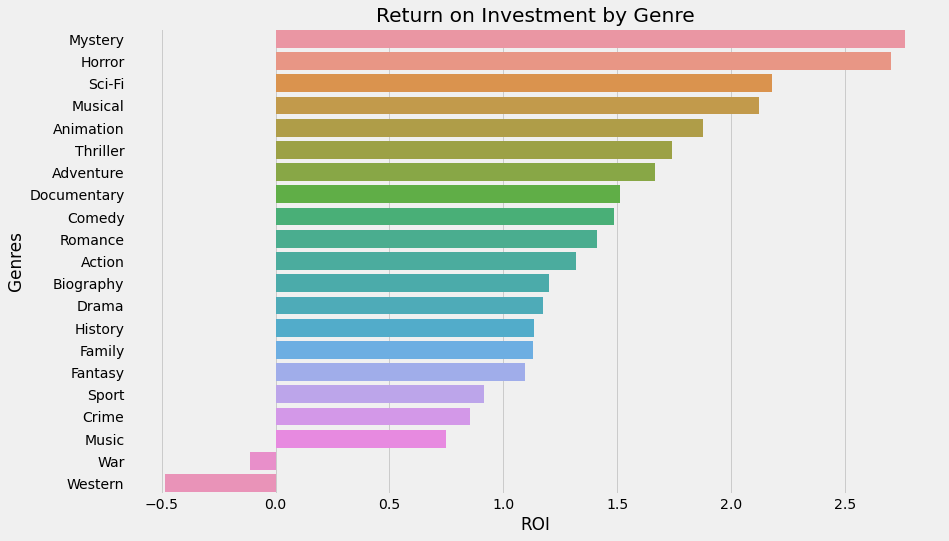
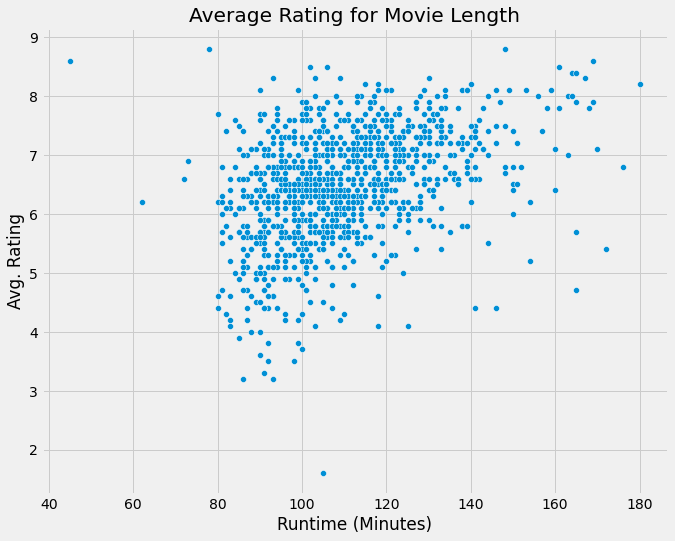

## Final Project Submission

Please fill out: 
* Student name:Justin Maffucci
* Student pace: full time
* Scheduled project review date/time: Thursday, March 25, 11:30am
* Instructor name: James Irving
* Blog post URL: TBD

# Microsoft Studios

**By:** Justin Maffucci

## Overview

Microsoft had decided to enter the original content video production business. In order to do so effectively, it's necessary to examine the current data and trends in the industry. Valuable insights can be gained by analyzing data from IMDB, Box Office Mojo, and The Numbers. Data from each of these sources must be cleaned, organized, and occasionally excluded for proper analysis.

## Business Problem

There are three main questions we are aiming to solve. Two of the three questions pertain to financial success metrics. The third question will help to answer what factors contribute to high vs. low movie rating reviews.

1. Which movie genre is most profitable in terms of return on initial investment?
2. Which directors' movies have been the most successful financially?
3. How does the length of the movie affect ratings?

## Data Understanding

- **Data Sources:** IMDB, Box Office Mojo, The Numbers
- **Variables Included:** Movie titles, cast & crew, release date, financial metrics, ratings, genres, and runtime.
- **Time Frame:** In order to esnure our conclusion will be based on the current state of the movie industry, we only analyze data from 2010-2019. We chose to exlude 2020 to ensure that the effects of the pandemic are removed from our analysis. 

## Data Analysis

    

    

    

    

    

    

## Evaluation

### ROI by Genre

The genres with the highest median return on investment are:
1. Mystery (2.77x)
2. Sci-Fi (2.18)
3. Horror (2.70)

The genres with the lowest median return on investment are:
1. Western (-0.49x)
2. War (-0.11x)
3. Music (0.75x)

### ROI by Director

The directors who have performed the best in terms of ROI  are:
1. William Brent Bell
2. Levan Gabriadze
3. Tod Williams

### Correlation between Runtime and Average Rating

There seems to be a general positive correlation between runtime and rating.

## Conclusions

Based on the data, it would make the most sense to start production with mystery, Sci-Fi, and horror movies. Movies in these genres have performed the best over the past ten years. Choosing any of the directors shown in the "Most Profitable Directors" graph would increase the chances of the studio being successful. Each of these directors has returned 20x the initial investment. Finally, there seems to be a somewhat loose correlation between the length of the movie and the ratings it receives. Of course, correlation does not prove causation, so we should proceed with caution and additional analysis. 
